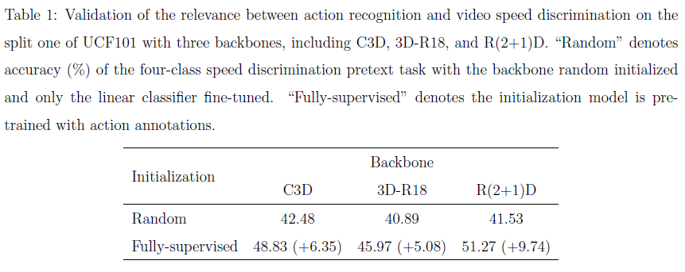

# SMP

### Introduction
This is the implementation of "Self-supervised Motion Perception for Spatio-temporal Representation Learning", an extension of our previous CVPR 2020 paper ["Video Playback Rate Perception for Self-supervised Spatio-Temporal Representation Learning"](https://openaccess.thecvf.com/content_CVPR_2020/papers/Yao_Video_Playback_Rate_Perception_for_Self-Supervised_Spatio-Temporal_Representation_Learning_CVPR_2020_paper.pdf).



 - **Fully-supervised Pre-training:**

 	We train three 3D CNNs, including C3D, 3D-R18, and R(2+1)D, on the split one of UCF101 with action annotations. Specifically, we train models with 300 epochs and set the batch size as 32, optimizer as SGD with cosine decay scheduler (warm-up the first five epochs to increase the learning rate to 0.1). The models with the smallest loss are stored for speed discrimination evaluation.


 - **Linear Probing Evaluation with PRP Task (Classification):**

 	With the frozen models, we only fine-tune the newly added FC layers. In details, we finetune 150 epochs, and set batchsize as 32. With a cosine decay scheduler, the initial learning rate is set to 0.0075 and annealed to zero.


### Citation

**C3D**
```
@inproceedings{tran2015learning,
  title={Learning spatiotemporal features with 3d convolutional networks},
  author={Tran, Du and Bourdev, Lubomir and Fergus, Rob and Torresani, Lorenzo and Paluri, Manohar},
  booktitle={IEEE CVPR},
  pages={4489--4497},
  year={2015}
}
```

**3D-R18**
```
@inproceedings{3DResNet,
  title={Can spatiotemporal 3d cnns retrace the history of 2d cnns and imagenet?},
  author={Hara, Kensho and Kataoka, Hirokatsu and Satoh, Yutaka},
  booktitle={CVPR},
  pages={6546--6555},
  year={2018}
}
```

**R(2+1)D**
```
@inproceedings{tran2018closer,
  title={A closer look at spatiotemporal convolutions for action recognition},
  author={Tran, Du and Wang, Heng and Torresani, Lorenzo and Ray, Jamie and LeCun, Yann and Paluri, Manohar},
  booktitle={IEEE CVPR},
  pages={6450--6459},
  year={2018}
}
```
